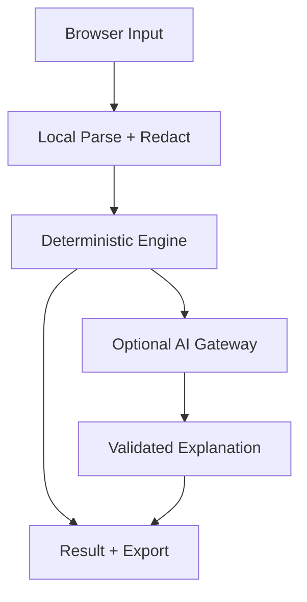

# 架构

## 数据流

## 分层

| 层 | 职责 | 禁止 |
|---|---|---|
| Web Shell | SEO 页面、导航、表单、状态与结果展示 | 保存 Provider Key |
| Local Core | 解析、脱敏、规则、计算、导出 | 隐式网络访问 |
| AI Gateway | 最小化请求、限流、预算、Provider 适配 | 记录请求正文 |
| Contracts | Lab、输入、输出、错误的版本化 Schema | 无版本破坏性变化 |
| Content Bridge | 相关文章、CTA、返回博客链接 | 复制整篇博客内容 |

## 仓库边界

`margrop-labs` 负责公众体验和产品合同；`ai-infrastructure-toolkit` 负责可复用基础设施采集与诊断内核。跨仓库集成优先使用版本化 Schema 或发布包，不复制粘贴核心逻辑。

## Lab 间 AI 复用

新 Lab 共用 AI Gateway 信封、Provider Adapter、服务端 Secret、OpenAI-compatible 传输、
Token/频率/并发上限、限流、熔断、错误映射、脱敏和结构化输出验证。每个 Lab 只实现自己的：

- 版本化业务输入与输出 Schema；
- 允许字段投影和确定性规则；
- Prompt、操作策略与无 AI 降级；
- 页面流程、证据展示和导出。

Token Forge 当前 Worker 是第一套生产消费者，不是复制模板。新增 AI 面试工作台时先抽取
通用 `lab_id + operation` 注册外壳，再分别挂载业务操作，并保持 Token Forge 的现有端点、
Secrets、策略账本和失败行为兼容。见
[ADR-0006](./adr/0006-interview-workbench-boundaries.md)。

## 失败策略

AI 不可用时仍应提供确定性结果或样例体验。输入无法安全脱敏、输出不符合 Schema、预算耗尽或 Provider 超时时，显示明确降级状态，不猜测补全。
